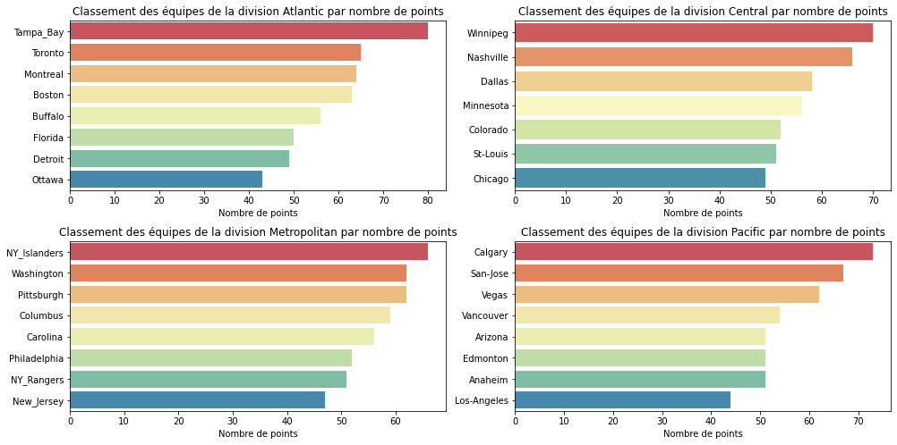
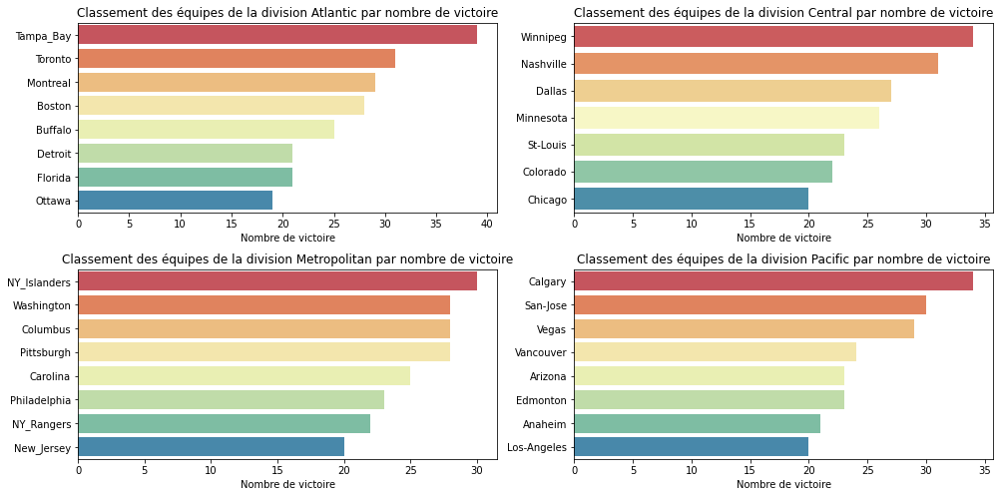
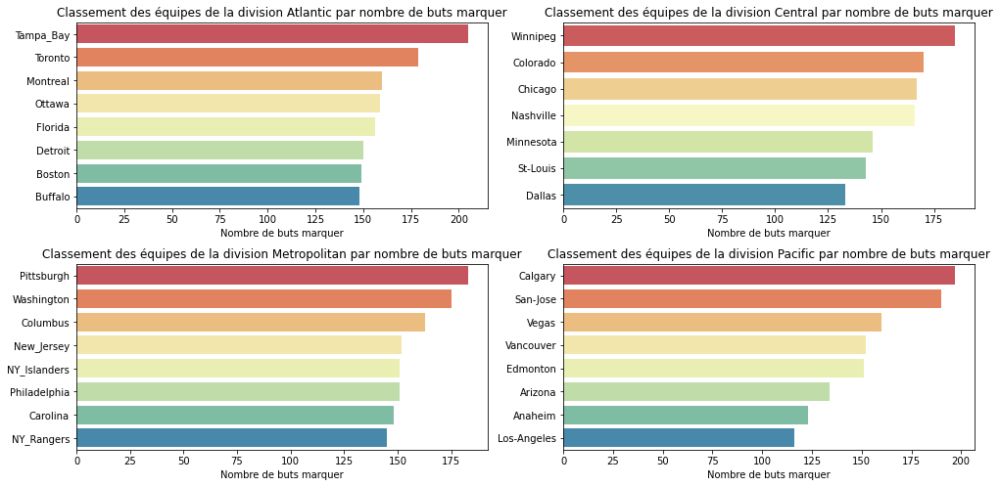
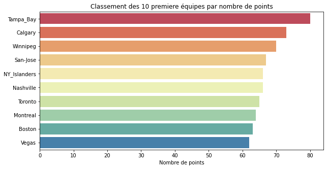
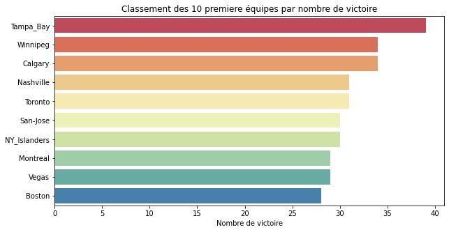
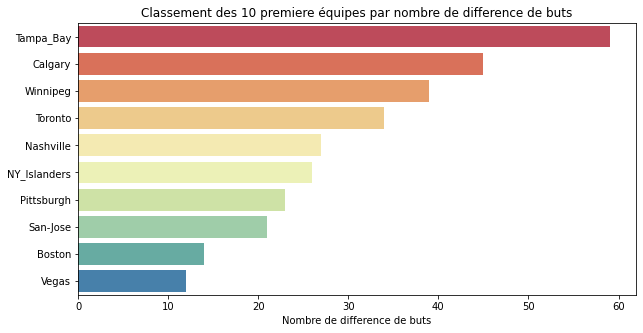
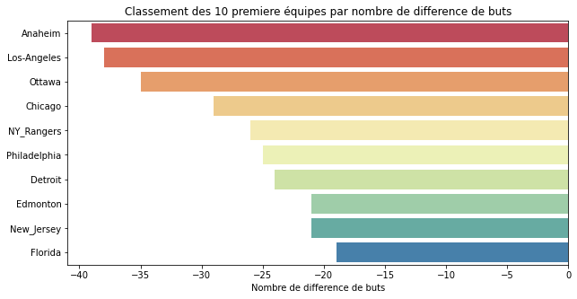
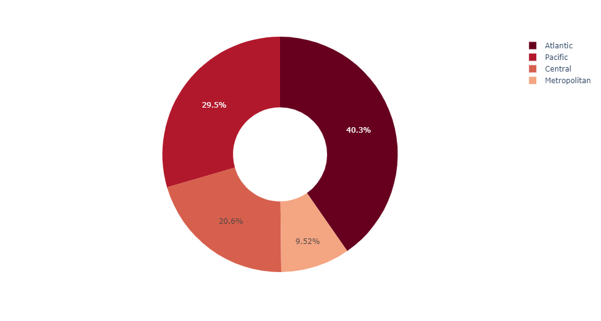
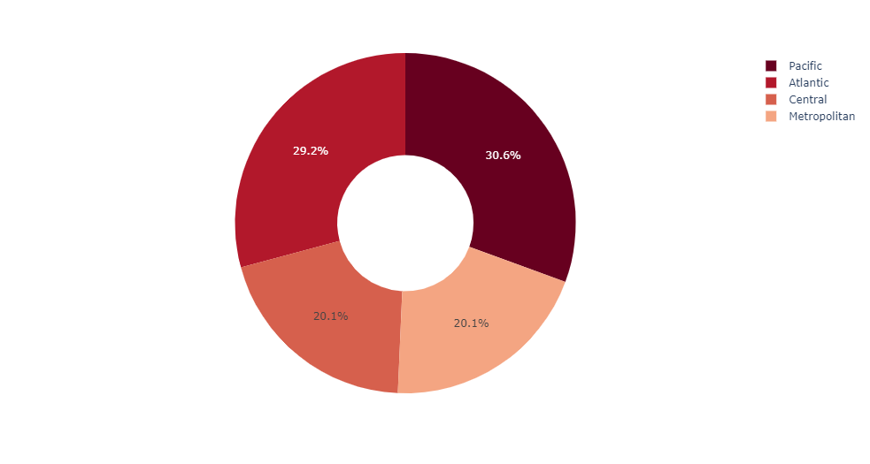

<p align="center">
  
</p>


# Projet:
- [Directives particulières](#directives)
- [Énoncé de travail](#enonce)
- [Lire et construire la base de données](#basedonne)
  - [Lecture de la base de données](#liredata)  
  - [Construire la base de données](#construire)
  - [Manipulation de la base de données](#manip)
  - [Trier la base de données](#trie)
  - [Information sommaire du dataframe] (#sommaire)
- [Analyse des données](#analyse)
  - [Analyse de la division](#div) 
  - [Analyse de la ligue](#ligue1) 
  - [Analyse de la ligue](#ligue2)
- [Annexe: Guide et normes de codage](#annexe)

## Directives particulières <a name="directives"></a>
* Respecter [guide de codage](https://github.com/INF1007-Gabarits/Guide-codage-python) et les normes pep8;
* Noms de variables et fonctions adéquats (concis, compréhensibles);  
* Pas de librairies externes autres que celles déjà importées;  
* Dans chaque programme, vous pouvez ajouter d’autres fonctions à celles décrites dans l’énoncé pour améliorer la lisibilité.

## Énoncé de travail <a name="enonce"></a>
<p align="justify">
L’analyse des données fait partie des disciplines les plus prisées de nos jours. Outil stratégique au sein des organisations, elle permet entre autres de mieux comprendre des événements qui se produisent avec les facteurs qui les favorisent, ou encore de mesurer l’impact d’une opération ou d’une politique grâce à des indicateurs de performance.</p>

## Lire et construire la base de données <a name="basedonne"></a>

### 1.1. Lecture de la base de données(lire_classement()):<a name="liredata"></a>
<p align="justify">
Cette fonction va lire la base de données à partir du fichier 'classement2019.txt'. La fonction lire_classement retourne un dictionnaire qui contient quatre dictionnaires, un dictionnaire pour chaque division, chaque division contient entre sept et huit équipes.
<p align="justify">

### 1.2. Construire la base de données(creer_df(...)):<a name="construire"></a>
<p align="justify">
La fonction creer_df elle prend en paramètre un dictionnaire qui contient les informations des équipes pour chaque division, et le transforme en dataframe en utilisant la bibliothèque Pandas.
<p align="justify">

```python
def creer_df(...):
    # ToDo: Vous devez creer votre dataframe a partir d'un dictionnaire
    # ToDo: Pour cela commencer par regrouper toute les equipe dans un seul dictionnaire
    # ToDo: Que vous allez convertir en dataframe. la fonction retourne un dataframe
    # Lien utile: https://pandas.pydata.org/docs/reference/api/pandas.DataFrame.from_dict.html


    return ...
```

```python
nhl_df = creer_df(ligue_classement)
print(nhl_df)
```
                  ABV  MJ   V   D  DP  PTS  VRP   BP   BC  DIFF           DIV
    Buffalo       BUF  51  25  20   6   56   22  148  156    -8      Atlantic
    Toronto       TOR  51  31  17   3   65   31  179  145    34      Atlantic
    Montreal      MTL  53  29  18   6   64   27  160  155     5      Atlantic
    Boston        BOS  52  28  17   7   63   27  149  135    14      Atlantic
    Detroit       DET  53  21  25   7   49   19  150  174   -24      Atlantic
    Tampa_Bay     T-B  52  39  11   2   80   35  205  146    59      Atlantic
    Florida       FLA  50  21  21   8   50   19  156  175   -19      Atlantic
    Ottawa        OTT  52  19  28   5   43   19  159  194   -35      Atlantic
    Washington    WAS  52  28  18   6   62   25  175  166     9  Metropolitan
    Columbus      CLB  51  28  20   3   59   28  163  159     4  Metropolitan
    NY_Islanders  NYI  51  30  15   6   66   28  151  125    26  Metropolitan
    Pittsburgh    PIT  52  28  18   6   62   27  183  160    23  Metropolitan
    Philadelphia  PHI  52  23  23   6   52   21  151  176   -25  Metropolitan
    NY_Rangers    NYR  51  22  22   7   51   17  145  171   -26  Metropolitan
    New_Jersey    N-J  51  20  24   7   47   19  152  173   -21  Metropolitan
    Carolina      CAR  52  25  21   6   56   24  148  155    -7  Metropolitan
    Winnipeg      WIN  52  34  16   2   70   32  185  146    39       Central
    Colorado      COL  51  22  21   8   52   22  170  167     3       Central
    St-Louis      STL  50  23  22   5   51   23  143  151    -8       Central
    Dallas        DAL  52  27  21   4   58   27  133  130     3       Central
    Minnesota     MIN  52  26  22   4   56   25  146  149    -3       Central
    Chicago       CHI  53  20  24   9   49   19  167  196   -29       Central
    Nashville     NAS  54  31  19   4   66   30  166  139    27       Central
    Los-Angeles   L-A  51  20  27   4   44   19  116  154   -38       Pacific
    Calgary       CAL  53  34  14   5   73   34  197  152    45       Pacific
    Vancouver     VAN  52  24  22   6   54   23  152  162   -10       Pacific
    Arizona       ARI  51  23  23   5   51   21  134  145   -11       Pacific
    San-Jose      SJS  53  30  16   7   67   30  190  169    21       Pacific
    Vegas         VGK  54  29  21   4   62   28  160  148    12       Pacific
    Edmonton      EDM  52  23  24   5   51   20  151  172   -21       Pacific
    Anaheim       ANA  52  21  22   9   51   18  123  162   -39       Pacific
    

### 1.3. Manipulation de la base de données(df_extraite_divison(...)): <a name="manip"></a>
La fonction df_extraite_divison prend deux paramètres, le premier et le dataframe de la ligue et le second le nom de la ligue, elle retourne un mini dataframe qui contient seulement les équipes de la division reçue en paramètre.

```python
def df_extraite_divison(df, divison):
    # ToDo: la fonction retourne le dataframe de la division recu en parametre
    # ToDo: Vous devez enlever la column DIV de votre dataframe
    # Lien utile: https://datacarpentry.org/python-ecology-lesson/03-index-slice-subset/index.html
    # Lien utile: https://pandas.pydata.org/docs/reference/api/pandas.DataFrame.drop.html
	
    return ...
```
Resultat attendu:
```python
for div in division:
    print(df_extraite_divison(nhl_df, div))
    print("\n")
```

               ABV  MJ   V   D  DP  PTS  VRP   BP   BC  DIFF
    Buffalo    BUF  51  25  20   6   56   22  148  156    -8
    Toronto    TOR  51  31  17   3   65   31  179  145    34
    Montreal   MTL  53  29  18   6   64   27  160  155     5
    Boston     BOS  52  28  17   7   63   27  149  135    14
    Detroit    DET  53  21  25   7   49   19  150  174   -24
    Tampa_Bay  T-B  52  39  11   2   80   35  205  146    59
    Florida    FLA  50  21  21   8   50   19  156  175   -19
    Ottawa     OTT  52  19  28   5   43   19  159  194   -35
    
    
                  ABV  MJ   V   D  DP  PTS  VRP   BP   BC  DIFF
    Washington    WAS  52  28  18   6   62   25  175  166     9
    Columbus      CLB  51  28  20   3   59   28  163  159     4
    NY_Islanders  NYI  51  30  15   6   66   28  151  125    26
    Pittsburgh    PIT  52  28  18   6   62   27  183  160    23
    Philadelphia  PHI  52  23  23   6   52   21  151  176   -25
    NY_Rangers    NYR  51  22  22   7   51   17  145  171   -26
    New_Jersey    N-J  51  20  24   7   47   19  152  173   -21
    Carolina      CAR  52  25  21   6   56   24  148  155    -7
    
    
               ABV  MJ   V   D  DP  PTS  VRP   BP   BC  DIFF
    Winnipeg   WIN  52  34  16   2   70   32  185  146    39
    Colorado   COL  51  22  21   8   52   22  170  167     3
    St-Louis   STL  50  23  22   5   51   23  143  151    -8
    Dallas     DAL  52  27  21   4   58   27  133  130     3
    Minnesota  MIN  52  26  22   4   56   25  146  149    -3
    Chicago    CHI  53  20  24   9   49   19  167  196   -29
    Nashville  NAS  54  31  19   4   66   30  166  139    27
    
    
                 ABV  MJ   V   D  DP  PTS  VRP   BP   BC  DIFF
    Los-Angeles  L-A  51  20  27   4   44   19  116  154   -38
    Calgary      CAL  53  34  14   5   73   34  197  152    45
    Vancouver    VAN  52  24  22   6   54   23  152  162   -10
    Arizona      ARI  51  23  23   5   51   21  134  145   -11
    San-Jose     SJS  53  30  16   7   67   30  190  169    21
    Vegas        VGK  54  29  21   4   62   28  160  148    12
    Edmonton     EDM  52  23  24   5   51   20  151  172   -21
    Anaheim      ANA  52  21  22   9   51   18  123  162   -39
    
    
### 1.4. Trier la base de données(df_sort_type(...)):   <a name="trie"></a> 
La fonction df_sort_type prend trois paramètres, le premier et le dataframe de la ligue, le second le type de tri, par exemple un tri selon le nombre de points ou un tri selon le nombre de buts, etc.…, le dernier paramètre est la direction de tri, sois par ordre croissant ou décroissant, pour trier le dataframe par ordre décroissant, ce paramètre doit être à False, True sinon. La fonction retourne le dataframe trié.

```python
def df_sort_type(...):
    #ToDo: la fonction tri le dataframe recu en parametre selon les variable type_sort et ascendant
    #ToDo: type_sort[V   D  DP  PTS  VRP   BP   BC  DIFF]
    #ToDo: ascendant = True(ordre decroissant), False(ordre croissant)
    # Lien utile: https://pandas.pydata.org/docs/reference/api/pandas.DataFrame.sort_values.html
    return ...
```
Resultat attendu:
```python
nhl_df_sort_by_pts = df_sort_type(nhl_df, "PTS", False)
print(nhl_df_sort_by_pts)
print("\n")
```


                  ABV  MJ   V   D  DP  PTS  VRP   BP   BC  DIFF           DIV
    Tampa_Bay     T-B  52  39  11   2   80   35  205  146    59      Atlantic
    Calgary       CAL  53  34  14   5   73   34  197  152    45       Pacific
    Winnipeg      WIN  52  34  16   2   70   32  185  146    39       Central
    San-Jose      SJS  53  30  16   7   67   30  190  169    21       Pacific
    NY_Islanders  NYI  51  30  15   6   66   28  151  125    26  Metropolitan
    Nashville     NAS  54  31  19   4   66   30  166  139    27       Central
    Toronto       TOR  51  31  17   3   65   31  179  145    34      Atlantic
    Montreal      MTL  53  29  18   6   64   27  160  155     5      Atlantic
    Boston        BOS  52  28  17   7   63   27  149  135    14      Atlantic
    Vegas         VGK  54  29  21   4   62   28  160  148    12       Pacific
    Washington    WAS  52  28  18   6   62   25  175  166     9  Metropolitan
    Pittsburgh    PIT  52  28  18   6   62   27  183  160    23  Metropolitan
    Columbus      CLB  51  28  20   3   59   28  163  159     4  Metropolitan
    Dallas        DAL  52  27  21   4   58   27  133  130     3       Central
    Buffalo       BUF  51  25  20   6   56   22  148  156    -8      Atlantic
    Minnesota     MIN  52  26  22   4   56   25  146  149    -3       Central
    Carolina      CAR  52  25  21   6   56   24  148  155    -7  Metropolitan
    Vancouver     VAN  52  24  22   6   54   23  152  162   -10       Pacific
    Colorado      COL  51  22  21   8   52   22  170  167     3       Central
    Philadelphia  PHI  52  23  23   6   52   21  151  176   -25  Metropolitan
    St-Louis      STL  50  23  22   5   51   23  143  151    -8       Central
    NY_Rangers    NYR  51  22  22   7   51   17  145  171   -26  Metropolitan
    Arizona       ARI  51  23  23   5   51   21  134  145   -11       Pacific
    Edmonton      EDM  52  23  24   5   51   20  151  172   -21       Pacific
    Anaheim       ANA  52  21  22   9   51   18  123  162   -39       Pacific
    Florida       FLA  50  21  21   8   50   19  156  175   -19      Atlantic
    Chicago       CHI  53  20  24   9   49   19  167  196   -29       Central
    Detroit       DET  53  21  25   7   49   19  150  174   -24      Atlantic
    New_Jersey    N-J  51  20  24   7   47   19  152  173   -21  Metropolitan
    Los-Angeles   L-A  51  20  27   4   44   19  116  154   -38       Pacific
    Ottawa        OTT  52  19  28   5   43   19  159  194   -35      Atlantic


```python
nhl_div_df = df_extraite_divison(nhl_df, "Atlantic")
nhl_div_df_sort_by_v = df_sort_type(nhl_div_df, "V", True)
print(nhl_div_df_sort_by_v)
```    
    
               ABV  MJ   V   D  DP  PTS  VRP   BP   BC  DIFF
    Ottawa     OTT  52  19  28   5   43   19  159  194   -35
    Detroit    DET  53  21  25   7   49   19  150  174   -24
    Florida    FLA  50  21  21   8   50   19  156  175   -19
    Buffalo    BUF  51  25  20   6   56   22  148  156    -8
    Boston     BOS  52  28  17   7   63   27  149  135    14
    Montreal   MTL  53  29  18   6   64   27  160  155     5
    Toronto    TOR  51  31  17   3   65   31  179  145    34
    Tampa_Bay  T-B  52  39  11   2   80   35  205  146    59
    
### 1.5. Information sommaire du dataframe (df_summary_inf(...)):  <a name="sommaire"></a>  
La fonction df_summary_inf affiche les statistiques de chaque de vision de la ligue ainsi que les statistiques de la ligue comme: l'équipe qui a le plus grand nombre de (victoire, défaite, de buts marquer, buts encaisser, points, etc.).
```python
def df_summary_inf(...):
    #ToDo: la fonction affiche les stats des equipes
    
	
```
Resultat attendu:
```python
df_summary_inf(nhl_df)
```
    Stats division Atlantic:
    
    	 l'équipe qui a le plus de victoire est Tampa_Bay avec 39 victoire
    
    	 l'équipe qui a le plus de defaite est Ottawa avec 28 defaite
    
    	 l'équipe qui a le plus de defaite par prolongation est Florida avec 8 defaite par prolongation
    
    	 l'équipe qui a le plus de points est Tampa_Bay avec 80 points
    
    	 l'équipe qui a le plus de buts marquer est Tampa_Bay avec 205 buts marquer
    
    	 l'équipe qui a le plus de buts encaisser est Ottawa avec 194 buts encaisser
    
    	 l'équipe qui a le plus de difference de buts est Tampa_Bay avec 59 difference de buts
    
    Stats division Metropolitan:
    
    	 l'équipe qui a le plus de victoire est NY_Islanders avec 30 victoire
    
    	 l'équipe qui a le plus de defaite est New_Jersey avec 24 defaite
    
    	 l'équipe qui a le plus de defaite par prolongation est NY_Rangers avec 7 defaite par prolongation
    
    	 l'équipe qui a le plus de points est NY_Islanders avec 66 points
    
    	 l'équipe qui a le plus de buts marquer est Pittsburgh avec 183 buts marquer
    
    	 l'équipe qui a le plus de buts encaisser est Philadelphia avec 176 buts encaisser
    
    	 l'équipe qui a le plus de difference de buts est NY_Islanders avec 26 difference de buts
    
    Stats division Central:
    
    	 l'équipe qui a le plus de victoire est Winnipeg avec 34 victoire
    
    	 l'équipe qui a le plus de defaite est Chicago avec 24 defaite
    
    	 l'équipe qui a le plus de defaite par prolongation est Chicago avec 9 defaite par prolongation
    
    	 l'équipe qui a le plus de points est Winnipeg avec 70 points
    
    	 l'équipe qui a le plus de buts marquer est Winnipeg avec 185 buts marquer
    
    	 l'équipe qui a le plus de buts encaisser est Chicago avec 196 buts encaisser
    
    	 l'équipe qui a le plus de difference de buts est Winnipeg avec 39 difference de buts
    
    Stats division Pacific:
    
    	 l'équipe qui a le plus de victoire est Calgary avec 34 victoire
    
    	 l'équipe qui a le plus de defaite est Los-Angeles avec 27 defaite
    
    	 l'équipe qui a le plus de defaite par prolongation est Anaheim avec 9 defaite par prolongation
    
    	 l'équipe qui a le plus de points est Calgary avec 73 points
    
    	 l'équipe qui a le plus de buts marquer est Calgary avec 197 buts marquer
    
    	 l'équipe qui a le plus de buts encaisser est Edmonton avec 172 buts encaisser
    
    	 l'équipe qui a le plus de difference de buts est Calgary avec 45 difference de buts
    
    Stats ligue:
    
    	 l'équipe qui a le plus de victoire est Tampa_Bay avec 39 victoire
    
    	 l'équipe qui a le plus de defaite est Ottawa avec 28 defaite
    
    	 l'équipe qui a le plus de defaite par prolongation est Anaheim avec 9 defaite par prolongation
    
    	 l'équipe qui a le plus de points est Tampa_Bay avec 80 points
    
    	 l'équipe qui a le plus de buts marquer est Tampa_Bay avec 205 buts marquer
    
    	 l'équipe qui a le plus de buts encaisser est Chicago avec 196 buts encaisser
    
    	 l'équipe qui a le plus de difference de buts est Tampa_Bay avec 59 difference de buts
    
    

## Partie 2: Analyse des données:<a name="analyse"></a> 
### 2.1. Analyse de la division(df_summary_divison(...)):   <a name="div"></a> 
La première analyse consiste à visualiser le classement de chaque division selon un critère reçu en paramètre et la direction du classement. La fonction df_summary_divison prend trois paramètres, le premier et le dataframe de la ligue, le second le type de tri, par exemple un tri selon le nombre de points ou un tri selon le nombre de buts, etc.…, le dernier paramètre est la direction de tri. 
```python
def df_summary_divison(...):
    # ToDo: La fonction va classer les equipes de chaque division selon le critere recu en parametre(type_sort)
    # ToDo: a l'aide de la bibliotheque seaborn visualiser le classement de chaque division
    # Lien utile: https://seaborn.pydata.org/tutorial/axis_grids.html
    # Lien utile: https://seaborn.pydata.org/generated/seaborn.barplot.html
    
	
```
Resultat attendu:
```python
df_summary_divison(nhl_df,"PTS", False)
```


```python
df_summary_divison(nhl_df,"V", False)
```



```python
df_summary_divison(nhl_df,"BP", False)
```



### 2.2. Analyse de la ligue(df_summary_league(...)): <a name="ligue1"></a>  
La seconde analyse consiste à visualiser le classement de ligue selon un critère reçu en paramètre et la direction du classement. La fonction df_summary_divison prend trois paramètres, le premier et le dataframe de la ligue, le second le type de tri, par exemple un tri selon le nombre de points ou un tri selon le nombre de buts, etc.…, le dernier paramètre est la direction de tri. 

```python
def df_summary_league(...):    
    # ToDo: La fonction va classer les equipes de la ligue selon le critere recu en parametre(type_sort)
    # ToDo: a l'aide de la bibliotheque seaborn visualiser le classement des10 meilleurs equipes dela ligue
    # Lien utile: https://seaborn.pydata.org/generated/seaborn.barplot.html
    
	
	
```
Resultat attendu:
```python    
df_summary_league(nhl_df,"PTS", False)
```



```python
df_summary_league(nhl_df,"V", False)
```





```python
df_summary_league(nhl_df,"DIFF", False)
```





```python
df_summary_league(nhl_df,"DIFF", True)
```





### 2.3. Analyse de la ligue(secteur_div(...)): <a name="ligue2"></a> 
La derniere analyse consiste à visualiser le pourcentage le pourcentage par division des 10 premiers equipes dans la ligue selon la variable type_data, par exemple si type_data = "PTS", vous devez visualiser le pourcentage de points de chaques divison parmi les 10 premieres equipes. La fonction df_secteur_div prend trois paramètres, le premier et le dataframe de la ligue, le second le type de donnees et le dernier paramètre est la direction de tri. 

```python
def df_secteur_div(...):
    #TODO: La fonstion affiche en secteur le pourcentage par division des 10 premiers equipes dans la ligue selon la variable
    #TODO: type_data, par exemple si type_data = "PTS", vous devez visualiser le pourcentage de points de chaques divison
    #TODO: Parmi les 10 premieres equipes
    #TODO: Trier le dataframe en utilisant la fonction df_sort_type
    #TODO: Extraite les 10 premier element du dataframe
    #TODO: Regrouper le dataframe en utilisant la fonction df_groupby_div
    # Lien utile: https://plotly.com/python/pie-charts/


```
Resultat attendu:
```python
df_secteur_div(nhl_df, "PTS", False)
df_secteur_div(nhl_df, "PTS", True)
```


```python
df_secteur_div(nhl_df, "V", False)
df_secteur_div(nhl_df, "V", True)
```



## Annexe: Guide et normes de codage <a name="annexe"></a>
- [Le guide maison](https://github.com/INF1007-Gabarits/Guide-codage-python) de normes supplémentaires à respecter
- [Le plugin Pycharm Pylint](https://plugins.jetbrains.com/plugin/11084-pylint) qui analyse votre code et indique certaines erreurs. 
- [Quelques indications en français sur PEP8](https://openclassrooms.com/fr/courses/4425111-perfectionnez-vous-en-python/4464230-assimilez-les-bonnes-pratiques-de-la-pep-8)
- [La documentation PEP8 Officielle](https://www.python.org/dev/peps/pep-0008/)


[0]: https://www.timeanddate.com/countdown/generic?iso=20211031T235959&p0=165&msg=Date+limite+remise+TP03+INF1007&font=cursive
[1]: https://latex.codecogs.com/svg.latex?{S_i}\left(%20{{X_i},{Y_i}}%20\right)
[2]: https://latex.codecogs.com/svg.latex?{S_j}\left(%20{{X_j},{Y_j}}%20\right)
[3]: https://latex.codecogs.com/svg.latex?{S_i}
[4]: https://latex.codecogs.com/svg.latex?{S_j}
[5]: https://latex.codecogs.com/svg.latex?{altitude_i}
[6]: https://latex.codecogs.com/svg.latex?{altitude_j}
[7]: https://latex.codecogs.com/svg.latex?M(i,j)%20=%20distance(i,j)
[8]: https://latex.codecogs.com/svg.latex?M(i,j)%20=%20-1
[9]: https://latex.codecogs.com/svg.latex?M(1,2)%20=%20distance(1,2)
[10]: https://latex.codecogs.com/svg.latex?M(1,25)
